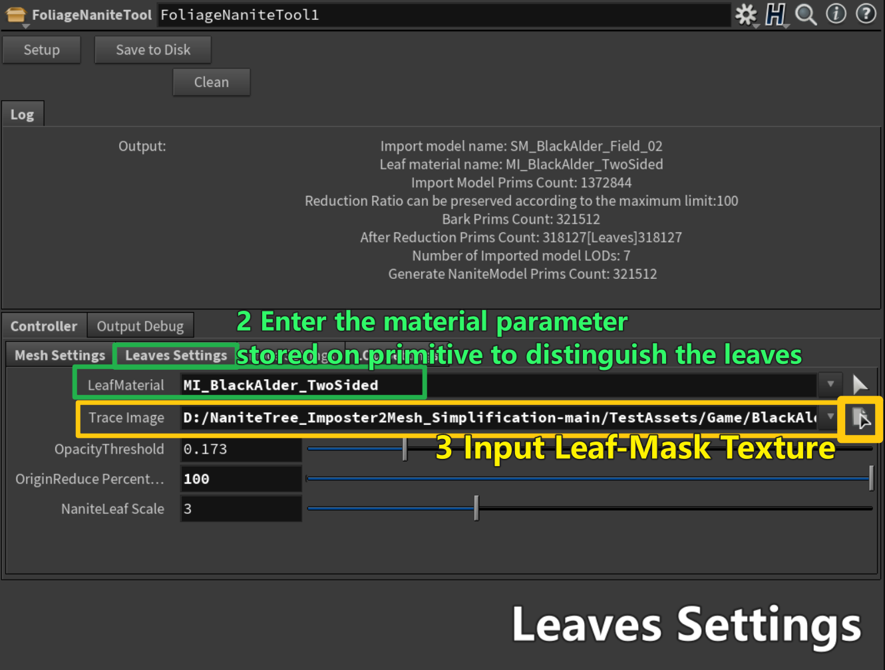
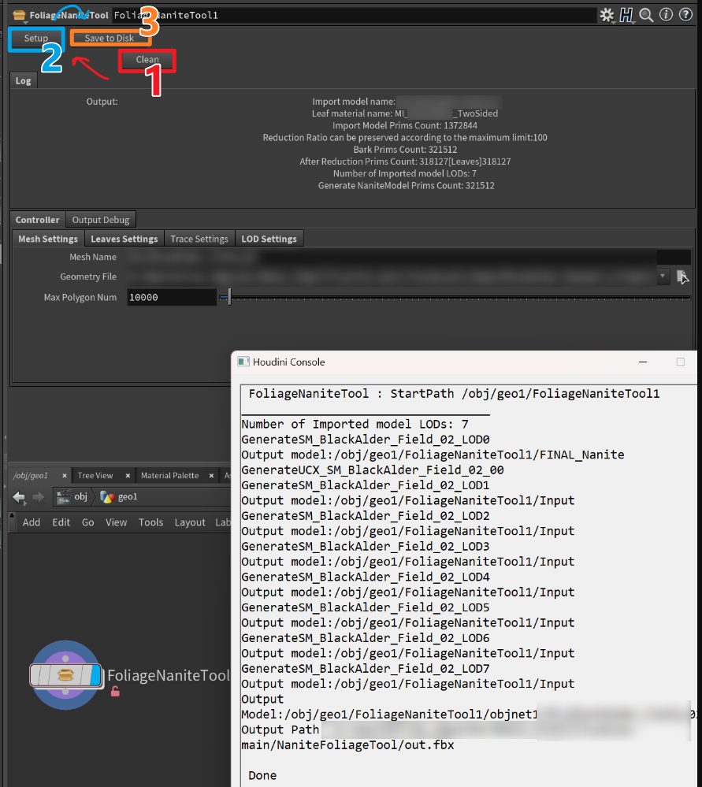
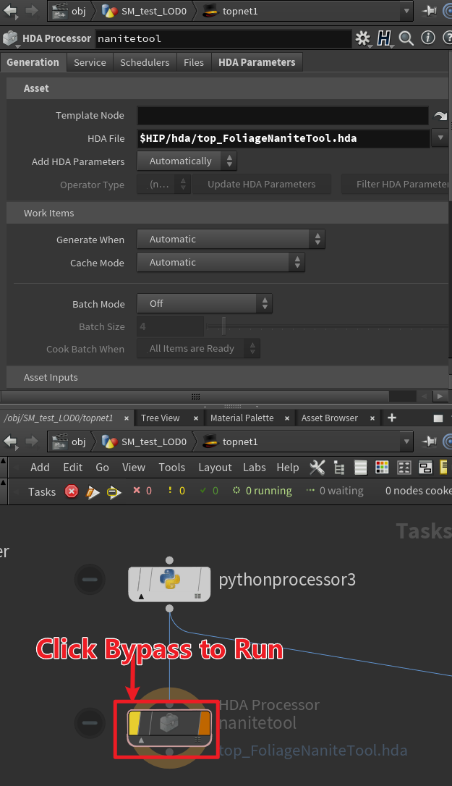
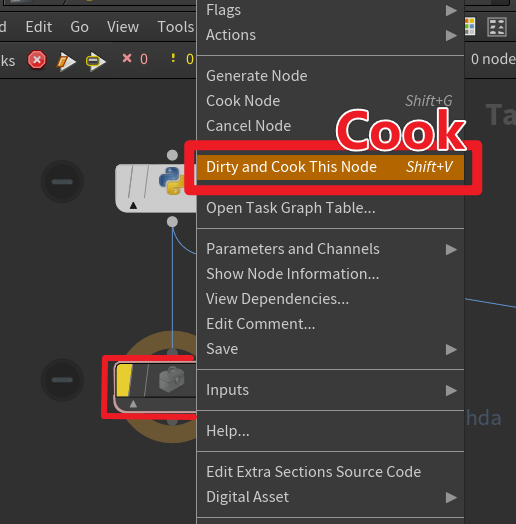
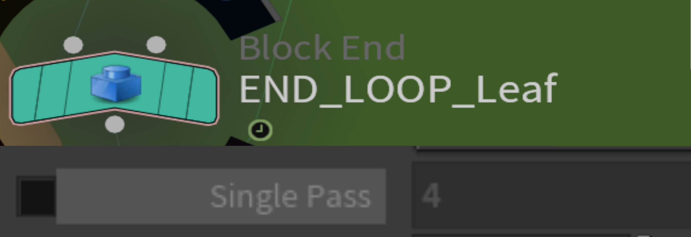
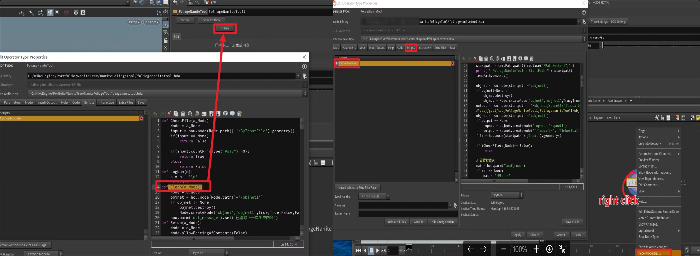

# NaniteTreePipeline

)

## Table of contents 导航
1. [Introduction 简介](#Introduction)

2. [Part one Implementation 工具使用流程](#Implementation)
    1. [Use in Houdini 在Houdini中使用](#Houdini)

    2. [Use in UnrealEngine 在虚幻引擎中使用](#Unreal)

3. [Part two Tech details 技术细节](#TechDetails)

## Introduction 简介 
### Toolbox Overview 工具一览
    The features annotated with ” HoudiniHDA “ are implemented with Houdini Digital Asset and depend on the specific version of Houdini (but you can also use our guidelines to annotate the features in different versions of Houdini) 
    
    The features annotated with “ UnrealPlugin ”, we plan to release free Unreal plugin in the mall, for real-time preview and adjustment of relevant Settings in the engine, use NaniteTree functions in the engine (some functions still rely on HoudiniPlugin for Unreal)

    标注了HoudiniHDA的功能是用Houdini Digital Asset实现的，依赖具体的Houdini版本（但你也可以通过我们的指引将功能适配到不同版本的Houdini中

    标注了 UnrealPlugin的功能，我们有计划在商场中发布免费的虚幻插件，用于在引擎内实时预览和调整相关设置，在引擎内使用NaniteTree的功能（部分功能仍依赖HoudiniPlugin for Unreal）

This is an automated Nanite Tree Tool designed to convert traditional non-Nanite vegetation models into Nanite models suitable for Unreal Engine 5. 

The core functions of this tool include vertex layout reconstruction, polygon merging, and LOD generation, aiming to simplify the process of vegetation asset creation and improve artistic creation efficiency.

Through our tool, artists can quickly convert original billboard models to leaf modeling vegetation models suitable for Nanite rendering, achieving higher-quality rendering effects and better performance.

这是一个基于流程的自动工具，旨在将传统的非Nanite植被模型一键转换为兼具最佳性能与效果表现的适用于Unreal Engine Nanite技术的模型资产（包括符合UE规范的碰撞体）

通过该工具，美术人员能够将原始插片模型快速转换为适应Nanite渲染（Opaque）的叶片建模植被模型，从而实现更高质量的渲染效果和更高的性能表现。

该工具的核心功能包括顶点布局重建、面数合并和LOD生成，旨在简化植被资产的制作流程并提高美术创作效率。

除提供自动化的资产转换功能外，该工具还允许美术人员根据需要微调参数，以优化最终的渲染效果。通过在引擎中验证每一步修改对最终效果的影响，美术人员可以更快地实现满意的渲染结果。

作为开源技术，我们希望通过推广我们的工具为Unreal Engine 5的植被制作流程提供了可靠的使用Nanite虚拟网格技术的解决方案，为游戏开发社区献出一项实用的技术工具。

通过开源，我们希望激发更多开发者参与其中，共同推动游戏行业的技术进步和创作效率的提升。

## Part Ⅰ Implementation 工具使用流程 
 @Hikohikoyan 

### Use in Houdini 在Houdini中使用 

#### Open HDA file
   1. Clone NaniteTree

    git clone https://github.com/jiayaozhang/NaniteTree.git
   2. find [**foliagenanitetool.hda**] in ..\NaniteTree\NaniteFoliageTool\
   3. Double-Click to Open HDA
   4. You'll open an **untitled.hip** within a hda node named [foliagenanitetool]
#### HDA Settings
##### 1. Set Model File

##### 2.Set Leaves Texture/MaterialName

**Clean** ----> **Setup** ----> **SaveToDisk** 

Outputs will be shown in Houdini Console Log
and the panel [Log]

### Batch processing based on the same configuration rule

    See Houdini PDG Graph tutorial 
    https://www.sidefx.com/products/houdini/pdg/
#### You Can Use **Run_TopNaniteTool.hip**

find [**Run_TopNaniteTool.hip**] in ..\NaniteTree\NaniteFoliageTool\Hips

### How to Use NaniteTree's node in Houdini of your version

Please check [Detailed Tutorial](./Mesh_Simplification/README.md)

## ## Build your own hda tool

If you want to modify or customize related functions based on this tool, you can refer to the following steps

Here you can modify the code mainly to control the buttons

<video src="./Webpage/static/videos/HowToUseNanateTreePipeLineTool.mp4"></video>

In the previous version, the output consistently produced incorrect leaves. This was due to the [END_LOOP_Leaf] node toggling [single pass], which caused the loop to step in a single plane and generate only one leaf. As a result, all subsequent processes yielded incorrect outcomes.

When using, you must first determine the following information of the input model [Model name] (name that affects the output) [Material name of the trunk] [Material name of the leaves] (This material name is the material slot name)

You can modify the code here, mainly to control the buttons

